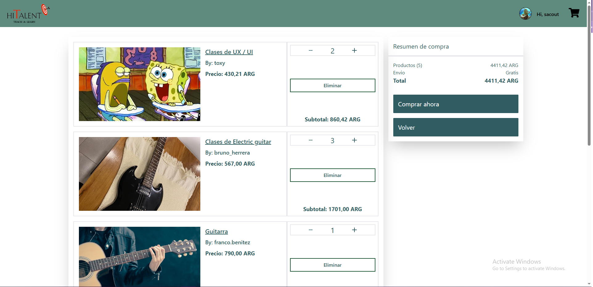

# **Hey , I'm Bruno!!**

<!--
**Lambda1158/Lambda1158** is a ✨ _special_ ✨ repository because its `README.md` (this file) appears on your GitHub profile.

Here are some ideas to get you started:

-  I’m currently working on ...
- 🌱 I’m currently learning ...
- 👯 I’m looking to collaborate on ...
- 🤔 I’m looking for help with ...
- 💬 Ask me about ...
- 📫 How to reach me: ...
- 😄 Pronouns: ...
- ⚡ Fun fact: ...
-->

# **🤔About myself**

### 🚀 Full Stack Developer | Systems Engineering Student

I'm a passionate software developer with experience in building web and mobile applications. I'm currently pursuing a degree in **Systems Engineering** at the **UTN(Universidad Tecnologica Nacional) FRM** and specialize in modern technologies like **React**, **Node.js**, **Next.js**, and **React Native**. Additionally, I have previous experience in administrative roles, which has helped me develop strong problem-solving, organizational, and teamwork skills.

---

# 𝗠𝘆 𝗧𝗲𝗰𝗸 𝗦𝘁𝗮𝗰𝗸  </h2>

<table>
  <tbody>
    <tr valign="top">
      <td width="25%" align="center">
        𝗛𝗧𝗠𝗟𝟱  
        
      </td>
      <td width="25%" align="center">
        𝗖𝗦𝗦𝟯  
        
      </td>
      <td width="25%" align="center">
        𝗝𝗮𝘃𝗮𝗦𝗰𝗿𝗶𝗽𝘁  
        
      </td>
      <td align="center" width="25%">
        ReactJS  
         
      </td>
    </tr>
    <tr valign="top">
      <td align="center" width="25%">
        NodeJS   
         
      </td>
      <td width="25%" align="center">
        <strong>Java</strong>  
        
      </td>
      <td width="25%" align="center">
        𝗚𝗶𝘁  
        
      </td>
      <td width="25%" align="center">
        Typescript  
        
      </td>
    </tr>
    <tr valign="top">
      <td align="center" width="25%">
        Python  
         
      </td>
      <td width="25%" align="center">
        Tailwind  
        
      </td>
      <td width="25%" align="center">
        PostgreSQL  
        
      </td>
      <td width="25%" align="center">
        Express  
        
      </td>
    </tr>
    <tr valign="top">
      <td align="center" width="25%">
        Redux  
         
      </td>
      <td width="25%" align="center">
        Next.js  
        
      </td>
      <td width="25%" align="center">
        Mongo DB  
        
      </td>
      <td width="25%" align="center">
        npm  
        
      </td>
    </tr>
  </tbody>
</table>

---

## **Proyects**

### GustoGourmet

  
  
  
  

### HiTalent

### Portafolio

  
  
  
  

---

### 📚 Education

- **Systems Engineering** - Universidad Tecnológica Nacional (2018 - Present).
- **Full Stack Web Developer** - Henry Bootcamp (2021).

## **Contact Me!**

If you're interested in my profile or have an opportunity that matches my skills, feel free to reach out:

- **LinkedIn**: [https://www.linkedin.com/in/brunoherreradev/](#https://www.linkedin.com/in/brunoherreradev/)
- **Email**: [brunoherrera1158@gmail.com](mailto:brunoherrera1158@gmail.com)

---
