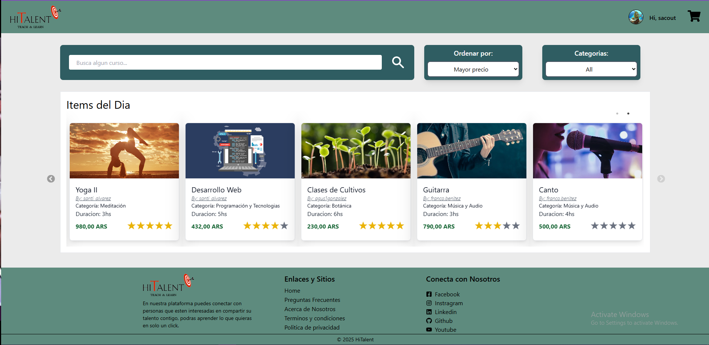
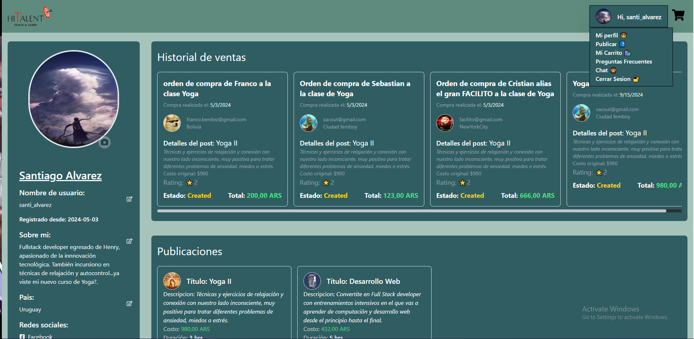

# **Hey , I'm Bruno!!**
---

<!--
**Lambda1158/Lambda1158** is a ✨ _special_ ✨ repository because its `README.md` (this file) appears on your GitHub profile.

Here are some ideas to get you started:

-  I’m currently working on ...
- 🌱 I’m currently learning ...
- 👯 I’m looking to collaborate on ...
- 🤔 I’m looking for help with ...
- 💬 Ask me about ...
- 📫 How to reach me: ...
- 😄 Pronouns: ...
- ⚡ Fun fact: ...
-->
---
# **🤔About myself**

- **I'm a Web Developer and a systems engineering student. I began studying programing in high school and since then it has become my passion.**

-  **🔭I'm Looking for a It job while finishing my degree.**

- **🌱 I’m currently learning Python , NestJs and MongoDB.**

---
# 𝗠𝘆 𝗧𝗲𝗰𝗸 𝗦𝘁𝗮𝗰𝗸   </h2>

<table>
  <tbody>
    <tr valign="top">
      <td width="25%" align="center">
        𝗛𝗧𝗠𝗟𝟱  
        
      </td>
      <td width="25%" align="center">
        𝗖𝗦𝗦𝟯  
        
      </td>
      <td width="25%" align="center">
        𝗝𝗮𝘃𝗮𝗦𝗰𝗿𝗶𝗽𝘁  
        
      </td>
      <td align="center" width="25%">
        ReactJS  
         
    </td>
    </tr>
    <tr valign="top">
      <td align="center" width="25%">
        NodeJS   
         
        </td>
       <td width="25%" align="center">
        <strong>Java</strong>  
        
      </td>
      <td width="25%" align="center">
        𝗚𝗶𝘁   
        
      </td>
      <td width="25%" align="center">
        Typescript  
       
      </td>
    </tr>
    <tr valign="top">
      <td align="center" width="25%">
        Python  
         
    </td>
      <td width="25%" align="center">
        Tailwind  
        
      </td>
      <td width="25%" align="center">
        PostgreSQL  
        
      </td>
      <td width="25%" align="center">
        Express  
        
      </td>
    </tr>
     <tr valign="top">
      <td align="center" width="25%">
        Redux  
         
    </td>
      <td width="25%" align="center">
        Next.js  
        
      </td>
      <td width="25%" align="center">
        Mongo DB  
        
      </td>
      <td width="25%" align="center">
        npm  
        
      </td>
    </tr>
  </tbody>
</table>

---
## **Proyects**

### GustoGourmet

### Hitalent

### Portafolio

### Weather app

---
## **Contact Me!**

  
---
